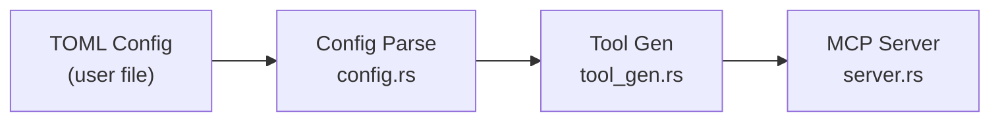

# cli-mcp Design Document

## Overview

cli-mcp is a config-driven bridge that exposes arbitrary CLI tools as MCP (Model Context Protocol) servers. Given a TOML configuration file describing a CLI's commands and their arguments, cli-mcp generates MCP tools and serves them over the stdio transport, allowing AI agents to invoke CLI commands in a structured, schema-validated way.

## Design Principles

1. **No heuristics**: cli-mcp does not attempt to discover, infer, or parse CLI structures. The config file is the single source of truth.
2. **Flat tool definitions**: Each tool is defined independently with its full command path. No recursive nesting—no assumptions about command hierarchy.
3. **Config-driven schemas**: Every tool's inputSchema and optional outputSchema come from the config. The server generates proper JSON Schema for MCP clients.
4. **Exit code semantics**: Success (exit 0) vs failure (non-zero) determines `isError` in tool results. No output parsing heuristics.
5. **Structured output opt-in**: Only tools that declare an `output_schema` attempt JSON parsing. All others return raw text.

## Architecture

### Startup Pipeline



### Runtime Flow

```mermaid
sequenceDiagram
    participant Client as MCP Client<br/>(AI agent)
    participant Server as MCP Server<br/>server.rs
    participant Executor as Executor<br/>executor.rs
    participant CLI as CLI Tool<br/>(npm, git, etc.)

    Client->>Server: tools/list
    Server-->>Client: Vec&lt;Tool&gt;

    Client->>Server: tools/call (tool_name, args)
    Server->>Executor: execute_command(resolved, args)
    Executor->>CLI: tokio::process::Command
    CLI-->>Executor: stdout, stderr, exit code
    Executor-->>Server: CallToolResult
    Server-->>Client: text content or structuredContent
```

### Module Responsibilities

#### `config.rs` — Configuration Model
- Defines the TOML-serializable config types: `CliConfig`, `CliMeta`, `ToolConfig`, `ArgConfig`
- Supports all argument types: positional, flag, option
- Supports all JSON Schema types: string, number, integer, boolean, array
- Handles array argument styles: repeated, comma-separated, space-separated
- Provides `parse_config()` for TOML deserialization with semantic validation
- Validates non-empty CLI name/executable, non-empty commands

#### `tool_gen.rs` — Tool Generation
- Converts flat `ToolConfig` entries into rmcp `Tool` structs
- Generates JSON Schema `inputSchema` from argument definitions
- Parses and attaches optional `outputSchema` from config (parsed once, shared)
- Produces a `ResolvedCommand` lookup map for the executor
- Detects and rejects duplicate tool names
- Handles environment variable merging (tool-level overrides cli-level)
- Handles working directory precedence (tool > cli)

#### `executor.rs` — Command Execution
- Spawns CLI processes via `tokio::process::Command`
- Enforces a 30-second execution timeout to prevent hanging
- Resolves arguments in correct order (positional first, then flags/options)
- Handles array argument expansion per configured style
- Appends raw_args after user arguments
- Sets environment variables and working directory
- Formats results based on exit code and outputSchema presence
- Includes stderr from successful commands as secondary content

#### `server.rs` — MCP Server
- Implements `rmcp::handler::server::ServerHandler`
- Returns tools via `list_tools`
- Dispatches tool calls via `call_tool` → executor
- Reports server info with tools capability

#### `main.rs` — Entry Point
- Parses `--config` path via clap
- Loads and validates config
- Generates tools
- Starts MCP server on stdio transport

## Key Design Decisions

### Flat Config Structure
We chose a flat tool definition model over recursive nesting. Each `[[tools]]` entry is independent—it specifies its full command path as an array. This means:
- `npm config set` and `npm config get` are separate entries, not nested under `config`
- `npm config` itself can also be a tool if the user defines it
- No implicit tool creation from parent commands
- No assumptions about which commands are "leaf" vs "branch"

This eliminates an entire class of ambiguity about when parent commands should become tools.

### TOML Format
TOML was chosen over JSON or YAML because:
- It's the idiomatic configuration format in the Rust ecosystem (Cargo uses it)
- The `toml` crate has excellent serde integration
- Multi-line strings (for `output_schema`) work cleanly with triple quotes
- Inline tables work well for simple env var definitions

### outputSchema and Structured Content
When a tool declares `output_schema`, the executor:
1. Trims and parses stdout as JSON
2. Returns it as `structuredContent` in the MCP response
3. If stdout isn't valid JSON, returns an error (`isError: true`)

When no `output_schema` is declared, stdout is returned as text content. Stderr from successful commands is included as secondary text content to surface warnings and deprecation notices.

This is strictly opt-in. Tools without `output_schema` just return raw text. This avoids false positives from commands that happen to output JSON-like content.

### Tool Naming Convention
Tool names follow the pattern `{cli_name}_{command_parts_joined_by_underscore}`. For example:
- CLI name `npm` + command `["install"]` → `npm_install`
- CLI name `npm` + command `["config", "set"]` → `npm_config_set`

This follows MCP's snake_case convention and creates unique, descriptive tool names.

### Argument Handling
Arguments are processed in two passes:
1. **Positional args** — appended in config definition order
2. **Flags and options** — appended after positionals

This ensures positional arguments maintain their intended order regardless of how the MCP client sends them (JSON object keys have no guaranteed order, but we follow config order).

## Error Handling Strategy

| Scenario | Behavior |
|----------|----------|
| Config file not found | Fatal error at startup |
| Invalid TOML syntax | Fatal error at startup |
| Invalid output_schema JSON | Fatal error at startup |
| Empty cli.name or command | Fatal error at startup |
| Duplicate tool names | Fatal error at startup |
| CLI executable not found | `isError: true` in tool result |
| Command exits non-zero | `isError: true`, stdout+stderr as message |
| Command exceeds timeout (30s) | `isError: true`, timeout message |
| outputSchema but non-JSON output | `isError: true`, descriptive error |
| Unknown tool name | `isError: true`, "Unknown tool" message |

Errors are always reported as tool-level errors (`isError: true` in `CallToolResult`), not as MCP protocol-level errors. This allows the AI agent to see and potentially recover from errors.

## Dependencies

| Crate | Purpose |
|-------|---------|
| `rmcp` | Official Rust MCP SDK — ServerHandler, Tool, CallToolResult, stdio transport |
| `clap` | CLI argument parsing (--config) |
| `tokio` | Async runtime for process execution and MCP transport |
| `serde` / `serde_json` | JSON serialization for schemas and structured content |
| `toml` | TOML config parsing |
| `tracing` / `tracing-subscriber` | Structured logging to stderr |

## Testing Strategy

The project uses TDD with progressive phases:

1. **Unit tests per module** — Config parsing, tool generation, command execution, server logic
2. **Integration tests** — Full pipeline tests using npm as a real CLI
3. **Test fixtures** — TOML config files in `tests/fixtures/`

Tests use real CLI commands (`echo`, `sh`, `npm`) rather than mocks, validating the actual execution pipeline end-to-end.
